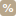

#  Calculate Mortgage 

Calculate Mortgage, czyli kredyt hipoteczny pod kontrolą. 

## Kalkulator stworzony z myślą o:
- śledzeniu przebiegu spłaty kredytu, 
- symulowaniu rónych scenariuszy spłaty,
- dokładnym liczenia nadpłat w konkretnym dniu, cyklicznie etc.
- łatwym dzieleniu się kalkulatorem poprzez URL.

## Przykład 1 - nadpłaty
Załóżmy że 1 dnia miesiąca dysponujesz budżetem na spłatę 4000 PLN. Twoja rata 15 dnia miesiąca wynosi 2000 PLN. Chcesz jednak zadeklarować dyspozycję nadpłaty już 1 dnia miesiąca. 

Prosta nadpłata w wysokości 2000 PLN nie załatwia sprawy z dwóch powodów:
1. Twoja rata zmniejszy się o odsetki, które wcześniej spłacisz razem z nadpłatą.
2. Dodatkowo od 1 do 15 dnia odsetki będą naliczane od mniejszej kwoty kapitału.

Jak więc do cholery to policzyć ???

### To proste! 

>W kalkulatorze wybierz wybierz "Skutek nadpłaty"[[1]](#skutek-nadplaty). 
>Potem "Typ nadpłaty"[[2]](#typ-nadplaty): "Wyrównaj do kwoty". 
>Wpisz kwotę 4000 PLN. 
>Wybierz też dokładną datę nadpłaty.[[3]](#data-nadplaty)  

<b>Voilà! Kalkulator policzy to za Ciebie :)</b>

----------

[1] <b>Skutek nadpłaty</b>, czyli co bank zrobi z zadeklarowaną dyspozycją nadpłaty? Najpierw spłaci odsetki narosłe do wybranego dnia? Czy pozwoli na 100% nadpłaty kapitału?

[2] <b>Typ nadpłaty</b>, czyli jak Ty chcesz żeby nadpłata była liczona? Opcje są dwie: 
1. Dana kwota. (chyba jasne ;))
2. Wyrównaj do kwoty => kwota najbliższej raty + wyliczona kwota nadpłaty = zadana kwota nadpłaty do której wyrównujemy.   

[3] <b>Data nadpłaty</b>, wybierz nadpłątę w: 
1. danym dniu, 
2. w dniu raty,
3. cyklicznie co miesiąc w danym dniu, 
4. cyklicznie co miesiąc w dniu raty.

## Przykład 2 - zapis/odczyt
Aplikacja pozawala na zapis stanu kalkulatora do przeglądarki użytkownika.
> Twoje dane zapisują się tylko na Twoim urządzeniu!  

Pod tytułem strony kliknij "Zapisz konfigurację" > wpisz nazwę pod jaką chcesz zapisać aktualny stan kalkulatora > <b>Voilà!</b>

Teraz gdy ponownie wejdziesz na stronę możesz odczytać zapisane dane. Pod tytułem strony kliknij "Wczytaj dane" > wybierz nazwę pod jaką zapisałeś konfigurację > <b>Voilà!</b>

## Przykład 3 - dzielenie się stanem kalkulatora z innymi! 
Stan kalkulatora jest zsynchronizowany z adresem URL strony. W skrócie oznacza to że możesz przesłać link znajomemu do Twojego stanu kalkulatora. (Link ten jest dość długi, co pozwala na zapis wszystkich informacji o nadpłatach etc.)

Jak to zrobić? 

> Skonfiguruj kredyt. 
> Dodaj nadpłaty.  
> Skopiuj Link. 
> Wyślij skopiowany link znajomemu! 

Stan kalkulatora zostanie odtworzony u znajomego na podstawie linku :) 
